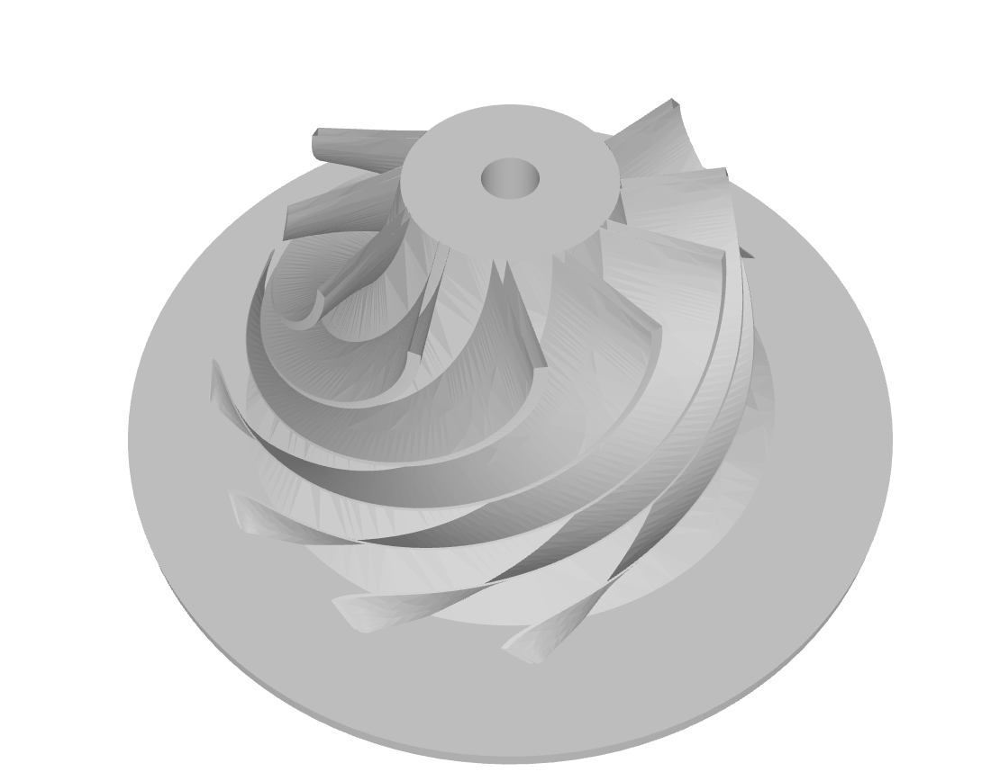
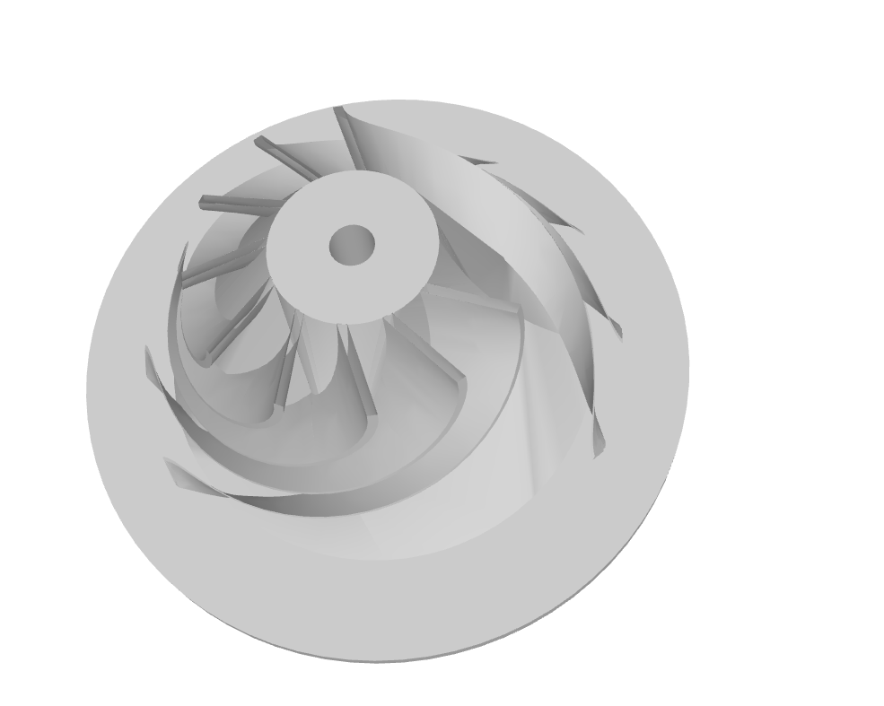

# Impeller v0.5 Surface-Graph-Faithful Export Evidence

Date: 2026-07-01

Related spec:

- `docs/superpowers/specs/2026-07-01-impeller-v0-5-surface-graph-faithful-export-design.md`

Related implementation plan:

- `docs/superpowers/plans/2026-07-01-impeller-v0-5-surface-graph-faithful-export.md`

## 1. Starting Feedback

After the placeholder STEP/STL export issue was corrected, the user opened the new
exports in a third-party CAD/STL viewer and found that the exported model did not
match the frontend geometry:

1. The exported model has an extra circular disk or backplate under the hub.
2. The apparent blade count can differ from the frontend run when a downloaded sample
   was generated with a different `blade_count`.
3. The hub bottom and bottom-face semantics do not match the frontend surface graph.
4. The frontend-visible blade edge closure surfaces are not visible as corresponding
   exported surfaces.

The user requested that the next DSL/research version, v0.5, make exported files
faithfully reflect `surface_graph`.

## 2. Uploaded Screenshots

The uploaded screenshots are preserved here as evidence of the mismatch.





## 3. Current-Code Diagnosis

The mismatch is architectural, not a viewer-only rendering issue.

Frontend rendering path:

- `frontend/src/components/ModelViewer.js` renders `manifest.geometry.surface_graph`
  whenever it is present.
- It only falls back to STL loading when no surface graph exists.
- Each frontend shaded surface is generated by triangulating one `surface.uv_grid`.

Backend export path:

- `src/part_rule_synthesis/service.py::_write_exports()` builds a separate CadQuery
  solid.
- For impellers, that path creates a circular disk with `circle(exit_radius).extrude(...)`
  before unioning hub and blades.
- Blade export uses `blade_loft_wires(...)` and `_impeller_blade_loft(...)`, which
  turns each blade into one loft solid.

The v0.4 open preset diagnostic snapshot:

```json
{
  "preset_id": "radial_open_reference_v0_4",
  "dsl_version": "0.4",
  "parameters": {
    "blade_count": 7,
    "inlet_radius_mm": 180.0,
    "exit_radius_mm": 620.0,
    "hub_curve_height_mm": 82.0,
    "mounting_bore_radius_mm": 40.0
  },
  "surface_count": 51,
  "blade_related_surface_count": 42,
  "edge_closure_surface_count": 28,
  "edge_closure_surfaces_per_blade": 4.0,
  "cad_export_blade_loft_count": 7,
  "cad_export_wire_sections_per_blade": 41,
  "first_blade_wire_point_count": 5
}
```

The surface graph contains 28 blade edge closure surfaces for a 7-blade open impeller:

- leading edge closure,
- trailing edge closure,
- root-to-hub closure,
- tip closure.

The current CadQuery export path does not export those graph surfaces one-for-one.

## 4. Root Cause

v0.4 made `surface_graph` the authoritative frontend and CFD-manifest geometry, but
the export path stayed as a separate CadQuery proxy model.

That proxy model is useful as a quick analysis-review artifact, but it violates the
newer ontology direction because it can:

- introduce surfaces not declared in `surface_graph`, such as the extra disk;
- omit declared surfaces, such as edge closure surfaces;
- merge graph identities during boolean union;
- lose surface roles, feature ownership, and patch-group identity;
- make third-party review inspect a different object from the frontend object.

## 5. v0.5 Decision

v0.5 should make `surface_graph` the authoritative export source.

Required export contract:

1. STL export triangulates the same `surface_graph.surfaces[*].uv_grid` that the
   frontend renders.
2. STEP export is either generated from those graph surfaces or explicitly marked as
   a lower-fidelity research STEP if exact OCCT surface sewing is not yet available.
3. No export path may create a material surface that is absent from `surface_graph`
   unless the manifest records it as a generated export-only support surface with an
   explicit role and reason.
4. Export artifacts must preserve enough metadata to trace each exported face or
   mesh region back to `surface_graph_id`, `feature_id`, `role`, and simulation
   visibility.

## 6. Ontology Insight

The important ontology change is that export is not a side-effect of geometry
generation. It is a view projection of a named graph.

The ontology should distinguish:

- `surface_graph`: authoritative generated geometry graph;
- `export_artifact`: a file artifact derived from one geometry view;
- `export_region`: a mesh shell or STEP face set derived from one surface graph node;
- `export_fidelity`: exactness and loss introduced during export;
- `view_projection`: CAD review, CFD full-360, FEA solid, or feature-debug subset.

This turns expert review feedback into traceable evidence:

```text
human marks bad surface in STL/STEP
-> export_region
-> surface_graph_id
-> feature_id
-> DSL constructor rule
-> design variable or topology variable
```

Without that chain, expert feedback on exported files cannot reliably support ontology
evolution.

## 7. Resulting v0.5 Direction

The chosen v0.5 design direction is:

```text
Surface-graph-faithful export contract
```

v0.5 does not need to solve industrial exact B-Rep sewing in one step. It must first
make exported inspection artifacts faithfully reflect the same graph that the frontend
and manifests use.

## 8. Implemented Result

The implemented v0.5 path adds:

- `radial_open_reference_v0_5` and `radial_closed_reference_v0_5` presets;
- `export_contracts/surface_graph_faithful.json`;
- binary STL generated from selected `surface_graph` `uv_grid` samples;
- STEP generated as a graph-derived AP242 tessellated triangular face set;
- `export_manifests.stl` and `export_manifests.step` metadata with exactness,
  counts, included surface ids, skipped triangle counts, and region provenance.

The STEP exactness label is `surface_graph_mesh_step`. This is intentionally not an
exact analytic B-Rep claim.

Verification on 2026-07-01:

- `verify_repository.ps1 -Mode fast`: backend focused tests `42 passed`, frontend tests `44 passed`, frontend build passed.
- `verify_repository.ps1 -Mode full`: backend tests `115 passed`, frontend tests `44 passed`, frontend build passed.
- `verify_version_lineage.ps1`: current v0.2-v0.5 resource folders passed; historical v0.2-v0.4 tags passed.

## 9. V0.5 Patch: STEP Size and Default Geometry

Follow-up review found that the first v0.5 STEP was still too large for routine
third-party inspection. The cause was not `surface_graph` size alone: the writer
duplicated three `CARTESIAN_POINT` and three `VERTEX_POINT` entities for every
triangle and wrapped them in a hand-authored open-shell representation.

The patch changes STEP export to:

- deduplicate sampled vertices at 1e-6 mm precision;
- write `CARTESIAN_POINT_LIST_3D` plus `TRIANGULATED_FACE_SET`;
- record `step_representation = ap242_triangulated_face_set`;
- record `vertex_count` in `export_manifests.step`.

Temporary local evidence after the patch:

```json
{
  "open_step_size_bytes": 1659904,
  "closed_step_size_bytes": 1870296,
  "open_triangle_count": 45184,
  "closed_triangle_count": 50560,
  "open_vertex_count": 21396,
  "closed_vertex_count": 24108,
  "local_cadquery_occt_open_step_import": "PASS"
}
```

The same patch also updates V0.5 defaults:

- `blade_count = 12` for open and closed V0.5 presets;
- leading/trailing edge lean defaults to `0`;
- leading/trailing edge sweep defaults to `0`;
- default Hub profile control points: `[[150, 400], [170, 250], [220, 150], [330, 50], [480, 10], [580, 0]]`;
- default Tip/Shroud profile control points: `[[230, 401], [250, 270], [310, 170], [400, 90], [490, 50], [581, 30]]`.

Ontology note: these are still sampled surface-graph exports. The STEP is now
smaller and locally OCCT-readable, but it remains a tessellated STEP artifact rather
than an exact analytic B-Rep with CAD-native chamfer operations.
