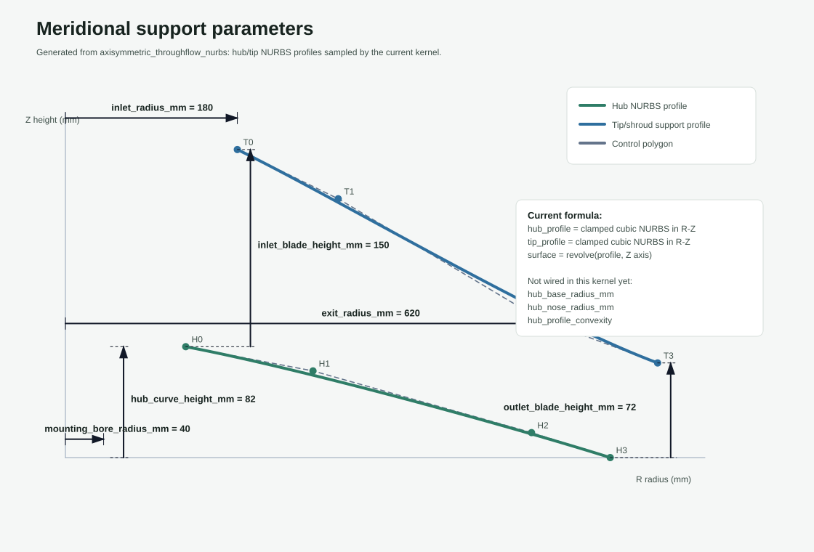
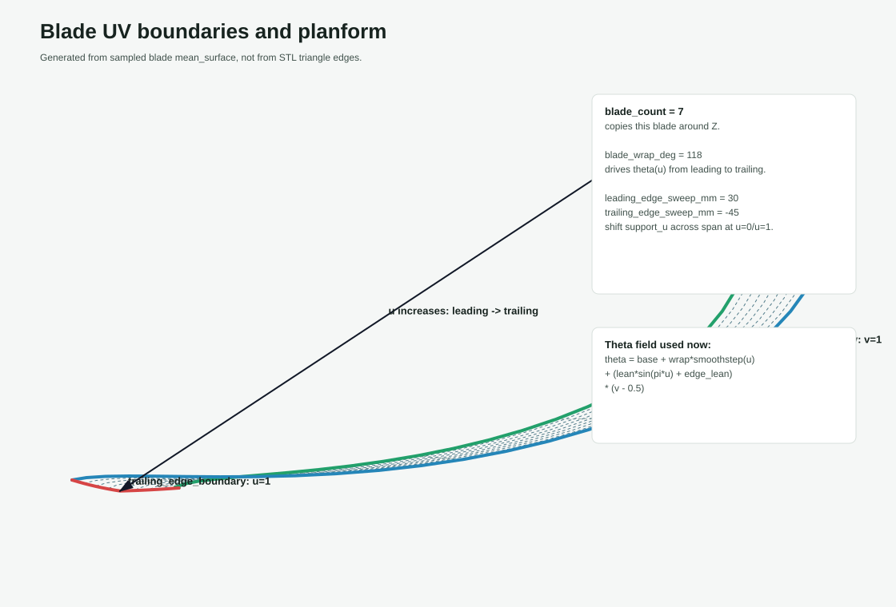
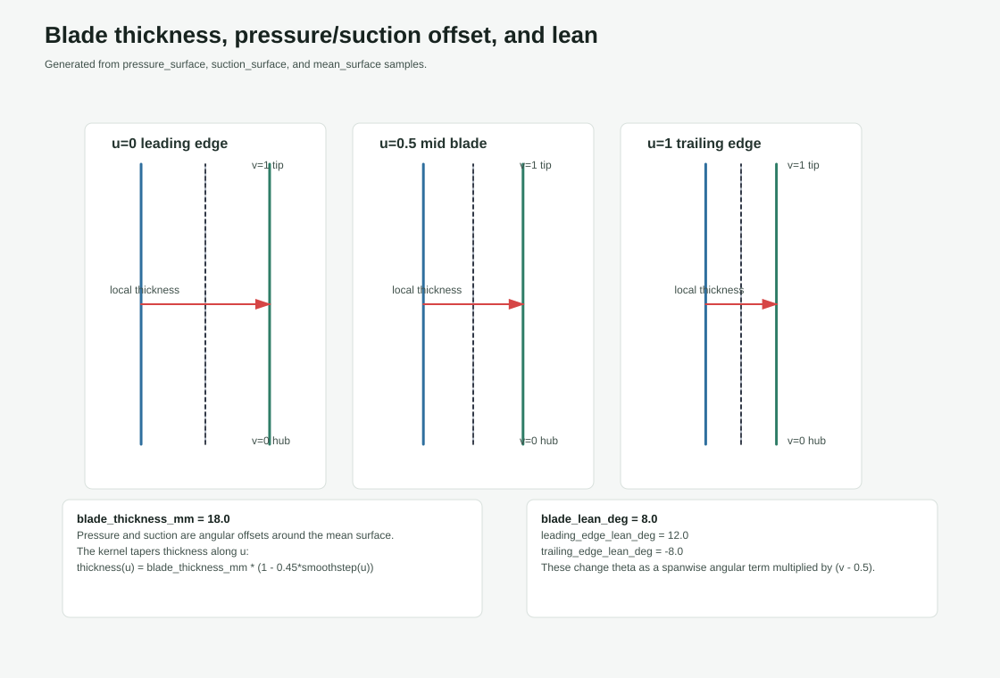
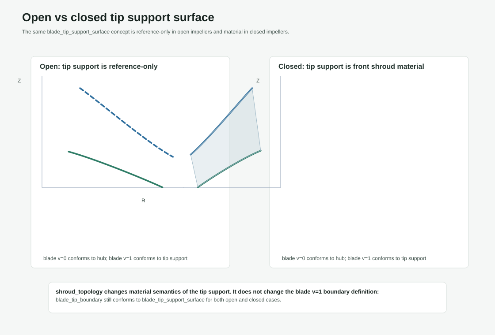

# Impeller Parameter Geometry

These figures are generated by `scripts/render_impeller_parameter_diagrams.py` from the current `axisymmetric_throughflow_nurbs` kernel. They are not AI-generated images.

## Figures

## Currently active kernel parameters

| Parameter | Geometric meaning in the current kernel |
| --- | --- |
| `blade_count` | Patterns the sampled blade around the Z axis. |
| `inlet_radius_mm` | Tip/support radius at `u=0`; also contributes to hub NURBS control points. |
| `exit_radius_mm` | Tip/support radius at `u=1`; also defines radial span and hub bottom radius. |
| `inlet_blade_height_mm` | Z separation between hub and tip support near the inlet/leading side. |
| `outlet_blade_height_mm` | Z separation between hub and tip support near the outlet/trailing side. |
| `hub_curve_height_mm` | Target height for the top of the hub meridional profile, subject to kernel safety clamps. |
| `mounting_bore_radius_mm` | Radius of the mounting bore cylinder, clamped against the hub profile. |
| `blade_wrap_deg` | Main angular progression term in `theta(u,v)` along blade `u`. |
| `blade_lean_deg` | Mid-blade spanwise angular lean term in `theta(u,v)`. |
| `leading_edge_lean_deg` | Spanwise angular lean term at `u=0`. |
| `trailing_edge_lean_deg` | Spanwise angular lean term at `u=1`. |
| `leading_edge_sweep_mm` | Support-curve `u` shift across span near the leading edge. |
| `trailing_edge_sweep_mm` | Support-curve `u` shift across span near the trailing edge. |
| `blade_thickness_mm` | Pressure/suction angular offset around the mean surface; tapered along `u`. |

## Currently not wired into this kernel

| Parameter | Current status |
| --- | --- |
| `hub_base_radius_mm` | Exposed as a shape-control semantic handle in the frontend, but not used by `axisymmetric_throughflow_nurbs` yet. |
| `hub_nose_radius_mm` | Exposed as a shape-control semantic handle in the frontend, but not used by `axisymmetric_throughflow_nurbs` yet. |
| `hub_profile_convexity` | Exposed as a shape-control semantic handle in the frontend, but not used by `axisymmetric_throughflow_nurbs` yet. |
| `root_fillet_radius_mm` | Present in DSL shape-control/validity vocabulary, but the current kernel creates ruled edge closure surfaces rather than radius-driven fillets. |
| `inlet_blade_angle_deg` / `outlet_blade_angle_deg` | Preserved in DSL presets and legacy paths, but the current axisymmetric NURBS kernel uses `blade_wrap_deg` and lean/sweep fields instead. |

## Preset context

- Open preset: `radial_open_reference` with facets `{'part_family': 'impeller', 'flow_topology': 'radial', 'passage_topology': 'throughflow_bladed_channel', 'shroud_topology': 'open', 'entry_topology': 'single_entry', 'suction_topology': 'single_suction', 'blade_exit_geometry': 'backward_curved', 'blade_population': 'full_blade_set', 'working_domain': 'pump'}` and 17 parameters.
- Closed preset: `radial_closed_reference` with facets `{'part_family': 'impeller', 'flow_topology': 'radial', 'passage_topology': 'throughflow_bladed_channel', 'shroud_topology': 'closed', 'entry_topology': 'single_entry', 'suction_topology': 'single_suction', 'blade_exit_geometry': 'backward_curved', 'blade_population': 'full_blade_set', 'working_domain': 'pump'}` and 17 parameters.
- Output directory: `docs\impeller_parameter_diagrams`.
